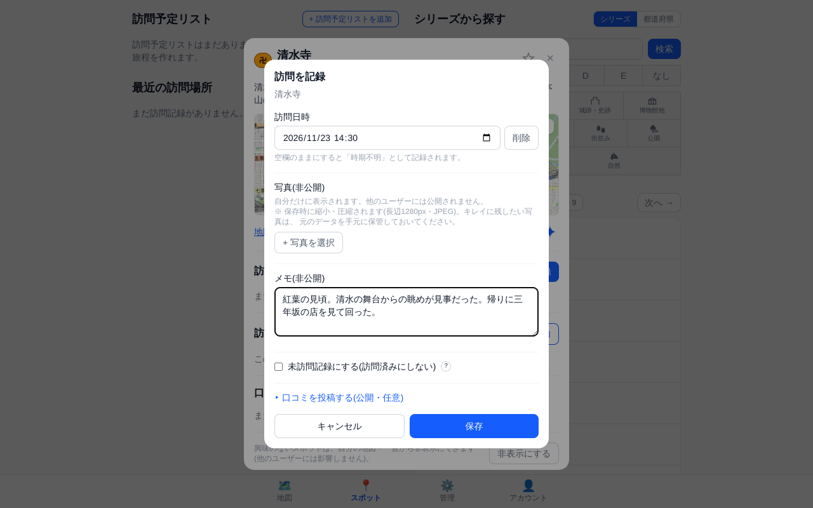

# Travel Log — 観光地訪問記録アプリ

観光地への「訪問記録」を主役にしたアプリ。

| 地図 | 訪問記録 |
|---|---|
|  |  |

ランクで大きさと色が、シリーズでピンの中のアイコンが決まる。訪問記録は日時・写真・メモを残せる。

## このアプリでできること

| | |
|---|---|
| **定番の観光地に「ランク」が付いて地図に並ぶ** | Wikipedia(ja)の月次ページビューから知名度をA〜Eの5段階にしたものを**ランク**として持ち、地図ピンの**大きさと色**になる。有名なところほど大きく目立つので、地図を眺めるだけで「この辺の目玉はどこか」が読める |
| **訪問記録で、観光スポットを1つずつ埋めていける** | 行った場所に**訪問記録**(いつ・何回・メモ・写真)を付けると、ピンが緑+✓に変わる。同じ場所へ何度行っても記録でき、後から編集も、**訪問回数を増やさない追記**もできる |
| **観光地データを管理画面から取り込める** | スポットデータはこのリポジトリに同梱していない(ライセンスの都合)。管理画面の「GitHubリポジトリからスポット種別取り込み」で [travel-log-data](https://github.com/rtcode337/travel-log-data) から取り込める |

## その他の機能

| 機能 | 説明 |
|---|---|
| **絞り込み** | ランク・シリーズ・訪問状態・カテゴリ・訪問日で絞れる。訪問日は「今日」をカレンダーを開かずに選べ、**「過去1年だけを表示」**でこの1年に訪問したスポットだけに絞れる |
| **見た目の3軸** | **ランク**(A〜E。色と大きさ)・**シリーズ**(1スポットに1つ。ピンの中のアイコンと形)・**カテゴリ**(複数可。絞り込み専用) |
| **訪問予定** | 行きたい場所のブックマーク。訪問を記録すると自動的に外れる |
| **訪問予定リスト** | 複数スポットを順序付きでまとめた旅程。地図に紫の矢印で経路を描き、Googleマップの経路検索へそのまま渡せる。回り終わったリストは**アーカイブ**して一覧から下げられる(中身は残り、スポット画面の「アーカイブ」から読み直せる) |
| **訪問記録への追記** | 後から思い出したこと・分かったことを、**訪問回数を増やさずに**同じ訪問記録へ書き足せる。「◯月◯日に追記」として元の記録の下に並び、写真も付けられる |
| **未訪問記録** | 「行ったが見られなかった」「事前の下調べ」を、訪問済みに数えない記録として残せる。日時を入れればその日の経路に含まれ、入れなければ下調べのメモになる |
| **非表示スポット** | 興味のない公開スポットを、自分の地図・一覧からだけ隠せる(他のユーザーには影響しない) |
| **口コミ** | 公開・本文のみのシンプルな投稿(同じスポットに何件でも書ける) |
| **スポット種別** | 観光地・郵便局・御朱印など。種別ごとに独立したURL・シリーズ・カテゴリ・対象地域を持ち、管理者が自由に追加・削除できる |
| **経路(巡った順の矢印)** | 巡った順に繋いだ線と矢印を地図に出す(CSVで取り込む)。線をタップすると経由地の一覧と区間ごとの説明が開く |
| **訪問日の軌跡** | 訪問記録のある日をカレンダーから選ぶと、その日に回った順に矢印で結んだ軌跡が出る。期間指定もできる |
| **旅程の天気** | 訪問予定リストの各スポットに予定日の予報アイコンが出る。**予定日の前後1週間を並べて天気の良い日を探し**、旅程の長さを保ったまま予定日をずらせる |
| **重ね表示** | 別のスポット種別を半透明で同じ地図に重ねられる |
| **対象地域** | 種別ごとに日本(都道府県)・特定の国(州・県)・世界全体(国)から選べる |
| **AIに聞く** | スポットの詳細から、Claude・ChatGPT・Perplexity・Grok・Geminiに所在地と座標を添えて質問できる(営業時間とアクセスを先に答えるよう頼んである) |
| **PWA対応** | ホーム画面に追加して、アドレスバーなしの独立アプリとして起動できる(オフライン対応は未実装) |

## スクリーンショット

| 地図 | 訪問記録 |
|---|---|
|  |  |

| スポット一覧 | スポット詳細 |
|---|---|
|  |  |

| 管理画面 | |
|---|---|
|  | |

## 技術スタック

| 領域 | 採用技術 |
|---|---|
| フロントエンド | Next.js (App Router) + TypeScript |
| UI | Tailwind CSS |
| 地図 | MapLibre GL JS(OpenStreetMap タイル) |
| 天気予報 | Open-Meteo(CC BY 4.0。旅程の各スポットの予報アイコン) |
| バックエンド | Next.js Route Handlers + PostgreSQL(Docker上でローカル完結) |

## セットアップ

```bash
docker compose -f docker-compose.dev.yml up --build
```

Node や Postgres をローカルにインストールする必要はない。初回起動時、
アプリが起動前に `01_schema.sql` を自動実行してテーブルと既定のスポット種別
(`tourist`=観光地、データは空)を作成する。以降スキーマに変更が入った場合も、
起動するたびに未適用のマイグレーションが自動で当たる。

http://localhost:7040 を開くと `/login` にリダイレクトされる。初回はアカウントが
存在しないため「アカウントを作成」フォームが表示されるので、メールアドレスと
パスワード(8文字以上)を入力して初回アカウントを作成する(自動的に管理者になる)。
他のユーザーを増やしたい場合は、管理者が`/[type]/admin`の「ユーザー管理」から追加する。

スマホの実機で確認するときは、`.env`に`ALLOWED_DEV_ORIGINS=<ホスト名かIP>`(カンマ区切りで複数可)を
設定してから起動する。未設定のまま`localhost`以外で開くと画面が真っ白になる。


観光地データを含め、スポットデータは同梱していないため、ログイン後に
[外部データ(travel-log-data)](#外部データtravel-log-data)の手順でCSVインポートする。

<details>
<summary>Docker を使わない場合</summary>

ローカルに Postgres を別途用意し、`.env.example` を `.env.local` としてコピーして
`DATABASE_URL` / `SESSION_SECRET` を設定した上で `npm install && npm run dev` でも
起動できる。その場合は `db/init/01_schema.sql` と `db/migrations/*.sql` を手動で実行する。

</details>

<details>
<summary>Googleログインの設定(任意)</summary>

メールログインに加えて、Googleアカウントでのログインも利用できる(設定しない場合は
メールログインのみ)。

1. [Google Cloud Console](https://console.cloud.google.com/apis/credentials) で
   OAuthクライアントID(種類: ウェブアプリケーション)を作成する
2. 「承認済みのリダイレクトURI」に `http://localhost:7040/api/auth/google/callback`
   を追加する(本番環境ではそのドメインのURLも追加する)
3. 発行された クライアントID / クライアントシークレット を設定する
   - Docker Compose の場合: リポジトリ直下に `.env` ファイルを作成し、
     `GOOGLE_CLIENT_ID` / `GOOGLE_CLIENT_SECRET` を書く(Next.js が読む
     `.env.local` とは別物なので注意)
   - Docker を使わない場合: `.env.local` に同じ2つの値を追加する

既存のメールアカウントと同じメールアドレスでGoogleログインした場合は自動的に紐付く。
既定では自由なサインアップはできず、管理者が作成したアカウントのみログインできる
(`GOOGLE_AUTO_SIGNUP=true`を設定した環境では、Googleでログインした人が一般ユーザーとして
自動登録される。**設定すると、URLを知っていてGoogleアカウントを持つ人は誰でも入れる**)。

**リバースプロキシ(HTTPS終端)の背後で動かす場合**、アプリが受け取るリクエストは
プロキシからのプレーンHTTPになる。リダイレクトURIのスキームは`X-Forwarded-Proto` /
`X-Forwarded-Host`から判断しているため、これらを送らないプロキシ(NAS内蔵の
リバースプロキシ機能など、設定項目が無いものもある)ではリダイレクトURIが
`http://`で組まれ、Googleコンソールに登録した`https://`のURIと一致せず認証に失敗する。
その場合は`PUBLIC_BASE_URL`に公開URLを設定する(設定するとヘッダより優先される)。

```
PUBLIC_BASE_URL=https://travel.example.com
```

- `.env`(Docker Compose)/ `.env.local`(Dockerを使わない場合)/
  standalone用のコピー(`docker-compose.standalone.yml`)冒頭の`x-public-base-url` のいずれかに書く
- パス部分は使わず、スキーム・ホスト・ポートだけを見る
- `https://`を設定するとセッションCookieに`Secure`属性が付く。同じインスタンスに
  LAN内から`http://<ホスト>:7040`で直接アクセスしてもログインできなくなる点に注意
  (公開URL経由でアクセスすること)
- 直接`http://<ホスト>:7040`で使う場合や、`X-Forwarded-*`を送るプロキシ(nginx等で
  設定済み)の場合は設定不要

</details>

### 本番運用

サーバーを持たずに公開する場合は
[Vercel + Supabase の手順](docs/hosting-vercel-supabase.md)を参照
(無料プランで動くが、訪問記録のZIPエクスポートだけは使えない)。以下はDocker運用の手順。

`main`へのpushでGitHub Actions(`.github/workflows/docker-publish.yml`)が本番用イメージを
ビルドして`ghcr.io/rtcode337/travel-log:latest`(+コミットSHAタグ)へ公開する。
本番ホストでは本リポジトリのクローン(`docker-compose.yml`を使う)を置き、
イメージはビルドせずpullして使う。

```bash
# 初回のみ: SESSION_SECRETを設定(リポジトリ直下の.envに書いておくのが楽)
echo "SESSION_SECRET=$(openssl rand -base64 32)" >> .env

# 初回・更新とも共通
docker compose pull && docker compose up -d
```

- Composeのプロジェクト名は本番・開発・standaloneとも`travel-log`。以前は
  `travel-log-prod`/`travel-log-dev`に分けていたため、**それ以前から動かしている
  ホストでは初回だけ旧スタックを止めてから起動すること**(止めずに`up`すると、
  同じ`data`を奪い合う新旧2つのスタックが並ぶ)

  ```bash
  docker compose -p travel-log-prod down          # 開発機では -p travel-log-dev -f docker-compose.dev.yml
  docker compose pull && docker compose up -d
  ```
- 公開されるイメージは`ghcr.io/rtcode337/travel-log`の1つ。スキーマとマイグレーションSQLも
  これに焼き込まれ、アプリが起動時に当てる(かつては`travel-log-db-init`という専用イメージが
  あったが、同じDBへ繋いでいるアプリに寄せた)
- **データの置き場は`data/`の1つだけ**(リポジトリ直下)。この下に`db/`(Postgresの実データ)・
  `photos/`(添付写真)・`exports/`(エクスポートのZIP)を`init`サービスが起動時に作る。
  **バックアップは`data/`をコピーすればよい**(停止してからコピーすること)。
  standaloneでもホストに用意するのは親ディレクトリ1つで、YAML冒頭の`x-data-dir`に書く
- **`app`は非rootで動く**。既定は`10001:10001`で、**ホストに実在しない番号**にしてある
  (万一コンテナから抜け出されても、ホストのユーザーのファイルには届かない)。
  そのぶん`data/`はホストから見て「知らないユーザー」の持ち物になるので、
  **バックアップから書き戻すときやホストで直接編集したいときは**`.env`に
  `TRAVEL_LOG_UID`/`TRAVEL_LOG_GID`で`id -u`/`id -g`を設定する
  (standaloneはYAML冒頭の`x-run-as`)。所有者合わせは起動前に`init`が
  自動でやるので、`chown`を手で打つ必要はない
- **置き場を`data/`にまとめる前から動かしているホストは、更新時に1回だけ移すこと。**
  `docker compose down`のあと:

  ```bash
  mkdir -p data/db
  sudo mv data/18 data/db/          # Postgresの実データ
  sudo mv photos/* data/photos/     # data/photos・data/exports が無ければ先に mkdir
  sudo mv exports/* data/exports/
  ```

  standaloneは冒頭の`x-db-data-dir`/`x-photos-dir`/`x-exports-dir`が`x-data-dir`1つに
  変わっているので、コピー側のYAMLも差し替える。移さずに起動すると空のDBが作られ、
  初期状態のアプリが立ち上がる(旧データは消えない)。
  さらに古い`db/data/`のままのホストは、先に`mv db/data data`を済ませてから上を実行する
- **PostgreSQL 16 時代のデータを持つ既存環境は、更新前に1回だけデータ移行が必要**
  ([docs/postgres-18-upgrade.md](docs/postgres-18-upgrade.md))。移行せずに起動すると
  dbコンテナが起動に失敗する(データは壊れない)
- **DBスキーマの更新は自動**。`docker compose up`すると`app`が待ち受けを始める前に未適用の
  マイグレーションを順に当てる(失敗した場合は待ち受けに進まないので、古いスキーマのまま
  動くことはない)。適用状況は
  `docker compose exec db psql -U travel_log -d travel_log -c "select * from schema_migrations"`、
  ログは`docker compose logs app`で確認できる(`migrate:`で始まる行)
- GitHub Actions(`GITHUB_TOKEN`)から公開したパッケージはリポジトリに自動リンクされ、
  可視性もリポジトリと同じ(=public)になるため、追加設定なしで匿名pullできる。
  リポジトリをprivateにした場合は本番ホストで`docker login ghcr.io`
  (`read:packages`権限のPAT)が必要になる
- イメージは`linux/amd64`と`linux/arm64`のマルチアーキで公開しており、pull時に
  ホストに合う方が自動選択される
- 特定時点に戻したいときは`docker-compose.yml`のイメージタグを`latest`から
  `sha-xxxxxxx`(Actionsが付けるコミットSHAタグ)に一時的に変えてpullし直す
  (マイグレーションは前進のみで、巻き戻しスクリプトは持たない。スキーマ変更を伴う
  リリースを戻す場合はDBのバックアップからのリストアが必要)
- Actionsはビルド番号(`20260722-1035-9162ba9`のようなJST日時+短縮コミットハッシュ)を
  イメージに埋め込み、管理画面`/[種別キー]/admin`の見出し横に表示する。今動いている
  イメージがいつのどのコミットのものか、pull後の反映確認に使える(ローカル開発時など
  埋め込みが無い場合は「開発ビルド」と表示される)

#### リポジトリを置けない環境(NASのコンテナマネージャー等)

`.env`もクローンも置けず、管理画面にYAMLを貼り付けて起動するタイプの環境向けに
[docker-compose.standalone.example.yml](docker-compose.standalone.example.yml)を用意している。
`${...}`を使わず値を直書きし、bindマウントを絶対パスで書いたもの(サービス構成・
起動順は`docker-compose.yml`と同じ)。`docker-compose.standalone.yml`としてコピーし
(コピー側は`.gitignore`済み。秘密を直書きするため雛形は直接編集しない)、冒頭の
「ここだけ編集」——3つの置き場(`db` / `data` / `photos`)の絶対パスと
`SESSION_SECRET`——を書き換えて貼り付ければ起動する。

`SESSION_SECRET`は空のままだとログイン時に`SESSION_SECRET is not set`で失敗するので、
必ず32バイト程度のランダム文字列を入れること。

## 画面

すべて`/[種別キー]/...`の形式(例: `/tourist/map`)で、種別ごとに切り替えて使う。
ルートパス`/`はログイン後、最後に開いていた種別(無ければ管理画面で設定した既定の種別)の`/map`へ自動リダイレクトされる。

| パス | 内容 |
|---|---|
| `/[type]/map` | 地図(ホーム)。ランク・シリーズ・訪問状態・カテゴリでフィルタ。ピンタップ→スポット詳細モーダルへ。別の種別のダウンロード済み公開スポットを半透明で重ねて表示することもできる(複数の種別を同時に重ねられる。タップで読み取り専用の詳細を表示し、そこから訪問記録と今の種別の訪問予定リストへの追加ができる)。経路・訪問順・訪問予定リストの詳細からはGoogle マップの経路検索で開ける(訪問予定リストの詳細では、地点の左端の≡をつかんで回る順番を入れ替えられる)。左下に今表示中のスポット種別名を小さく表示 |
| `/[type]/spots` | 「都道府県から探す」(地域別ドリルダウン)と「シリーズから探す」(検索+絞り込み+ページング)の2タブ |
| `/[type]/admin` | (管理者・スポット管理者専用)スポットの承認待ちキュー・追加・編集・削除・CSVインポート・経路(巡った順の矢印)のインポート・travel-log-dataへの還元用エクスポート(手動追加した公開スポットと画面から削除したCSV由来スポットの一覧をMarkdownでダウンロード)・間違い報告のあったスポットの一覧(名前と理由をまとめてAIに渡すテキストにできる/まとめて取り消せる)。adminのみキー一覧を指定しての削除・GitHubリポジトリ(travel-log-data形式)からの一括取り込み・スポット種別の管理・ユーザー管理も可能 |
| `/[type]/account` | 自分のメールアドレス・ロール・現在の種別の表示、ログアウト、訪問記録ZIPのダウンロード(管理者が作成したとき)、アカウント削除。スポット種別の切り替えは`/[type]/map`の左下の種別チップから行う |
| `/login` | メールログイン、または Google でログイン(任意、要設定) |

## 権限とスポット承認フロー

| ロール | できること |
|---|---|
| 管理者(admin) | 全操作可能。スポット承認・編集・削除、スポット種別の管理、ユーザー管理。初回セットアップで作成した唯一のアカウントが自動的に管理者になる |
| スポット管理者(spot_admin) | スポットの承認・編集・削除・公開作成(adminと同等)。種別設定・ユーザー管理は不可 |
| モデレーター(moderator) | 地図上でのスポット追加(非公開または承認待ち)。承認待ちキューの閲覧のみ |
| 一般ユーザー(user) | 閲覧、自分の訪問記録・訪問予定の管理、非公開スポットの追加のみ |

新しいアカウントは`/[type]/admin`の「ユーザー管理」(admin専用)から作成する
(既定では自由サインアップ不可。`GOOGLE_AUTO_SIGNUP`については「セットアップ」のGoogleログインの節を参照)。

利用者は自分でアカウント画面から**アカウント削除**できる。訪問記録・写真・訪問予定・口コミ・非公開スポットは
消え、登録した公開スポットは登録者の情報だけを外して残る(他のユーザーの地図から消さないため)。
最後の管理者はアカウントを削除できない。

`/[type]/map`上で右クリック(モバイルは長押し)するとスポットを追加できる。送信時のstatusは
ロールにより既定が異なり(`user`は非公開、それ以外は承認待ち)、admin/spot_adminは
`/[type]/admin`の承認待ちキューから個別承認、または「すべて承認」で一括公開できる。
追加フォームの「訪問を記録」(名前欄の下)を開いたまま送信すると、そのスポットに訪問記録が1件つく
(いま訪れている場所を、追加と記録の2手順を踏まずに残せる)。

## 訪問予定・未訪問記録・口コミ・訪問写真

スポット詳細モーダルから、以下を管理できる。

- **訪問予定(非公開)**: 「行きたい場所」のブックマーク。訪問を記録すると自動的に外れる
- **未訪問記録(非公開)**: 訪問記録と同じフォーム・同じ訪問履歴に「訪問済みに数えない
  記録」として残すメモ(訪問記録フォームのチェックボックスから)。
  訪問日を入れると「訪れたが改めて来たい」記録としてその日の訪問順の経路に含まれ、
  訪問予定からも外れる。訪問日なしは下調べのメモになり、訪問予定は残る。
  どちらもピンは緑にならず、一覧では「未訪問」バッジ付きで表示される
- **非表示スポット**: 興味のない公開スポットを自分の地図・一覧から隠すユーザーごとの設定。
  解除は`/[type]/spots`の「非表示にしたスポット」から
- **間違い報告(管理者・スポット管理者のみ)**: 中身がおかしい公開スポットに理由を添えて
  報告する(理由は空でもよい)。スポット自体には影響せず、`/[type]/admin`の一覧に集まる。
  一覧からは名前と理由だけのテキストにまとめてAIに渡せ、片付いたらまとめて取り消せる
- **口コミ(公開)**: 星評価はなく本文のみ。投稿するたびに増える掲示板方式で、同じスポットに何件でも書ける
- **写真(非公開)**: 自分の訪問記録にのみ添付。ブラウザ側で縮小・圧縮した上で`data/photos/`
  フォルダ(Dockerではbindマウント)に保存され、`/api/photos/...`経由(本人のみ)で配信する。
  サムネイルをタップすると拡大表示になり、**ピンチ(かダブルタップ)で拡大縮小、
  スワイプで同じ訪問記録の前後の写真へ**移れる(追記に付けた写真も同じ並びに続く)
- **訪問記録のエクスポート**: 管理者が`/[type]/admin`で対象ユーザーのメールアドレスを
  指定して実行すると、そのユーザーの訪問記録を全スポット種別ぶんまとめたZIPが
  バックグラウンドで作られる(`visits-<種別キー>.csv`=訪問のメモ+スポット情報、
  `photos/`=添付写真)。出来上がったZIPは管理画面と、対象ユーザー本人のアカウント画面から
  ダウンロードできる。ZIPは`data/exports/`に置かれ、同じユーザーのものは最新1件だけ残る

スポット詳細にはWikipedia検索による概要表示機能もある(種別ごとにON/OFF・参照言語版を設定可)。

## 外部データ(travel-log-data)

スポットの初期データ(シード用CSV)は本リポジトリには同梱せず、別リポジトリ
[travel-log-data](https://github.com/rtcode337/travel-log-data)にスポット種別ごとの
CSVとして置き、`/[type]/admin`のCSVインポート機能で取り込む(`tourist`=観光地も含め全種別共通)。

```csv
name,name_kana,lat,lng,region,rank,series,categories,description,key
厳島神社,いつくしまじんじゃ,34.2960222,132.3198944,広島県,A,神社,,海に浮かぶ大鳥居,厳島神社
```

- 必須列: `name`, `lat`, `lng`, `region`。`rank`はA〜Eか空欄(ランクを使う種別のみ意味を持つ)。
  `series`/`categories`は自由入力。
  `categories`は1スポットに複数付けられ、パイプ区切りで書く(列ごと省略した場合は
  既存スポットのカテゴリを変更しない)。`key`は省略可の種別内一意な参照キー
  (経路のCSVがスポットを指すのに使う)
- 上記以外の列がヘッダーにあるとインポートを中止する。綴り違いや旧フォーマットの
  CSVが、値の欠けた状態で黙って取り込まれるのを防ぐため
- 差分更新(`key`一致を最優先、無ければ`name`+`lat`+`lng`の完全一致で同一判定)。
  一致した既存スポットは内容が違えばCSVの内容で上書きされるため、CSV側の修正も
  再アップロードだけで反映され、同じCSVを何度アップロードしても重複登録されない
- スポットを巡った順に矢印で繋ぐ経路は、別ファイル`routes.csv`(列:
  `route,series,seq,spot_key,description,leg_description`)を同じ管理画面から
  スポットCSVの後に取り込む(スキーマの詳細はtravel-log-data/README.md参照)
- **CSVから行を消してもDBからは消えない**(差分更新はCSVに無い行に触らないため)。
  削除は`/[type]/admin`の「キー一覧を指定して削除」(admin専用)に`key`を1行1つ
  貼り付けて行う。travel-log-data側の`exclude.txt`(削除したスポットのkeyを追記して
  いくファイル)をそのまま貼る想定で、該当が無いキーはエラーにせず読み飛ばす

観光地(`tourist`)データの`description`はWikipedia記事冒頭文の引用(CC BY-SA 4.0)、
`lat`/`lng`はWikipedia記事座標(CC BY-SA 4.0)またはWikidata `P625`(CC0)由来のため、
それぞれの出典表示はtravel-log-data側で行っている(本リポジトリのMITライセンスはアプリのコードにのみ適用)。
ランクの決め方などデータの詳細はtravel-log-data/README.mdを参照。

## スポット種別のカスタマイズ

管理者は`/[type]/admin`から新しい種別を追加でき、種別ごとに次を設定できる。

- 一般公開のON/OFF(既定OFF=admin/spot_admin限定)、口コミ・Wikipediaリンクの有効/無効
- 対象地域(日本/特定の国/世界)、Wikipedia検索の言語版
- ランク(A〜E)を使うかどうか
- シリーズの一覧・見た目(ピンの中のアイコン/文字・形、ランクを使わない種別では色)、カテゴリの一覧

キー・表示名の手入力フォームのほか、`{ key, label, settings?, series?, categories? }`形式の
JSONファイルアップロードでも一括設定できる(travel-log-dataリポジトリの
`<スポットキー>/settings.json`が実例。スキーマの詳細はtravel-log-data/README.md参照)。

## ライセンス

[MIT License](LICENSE)
