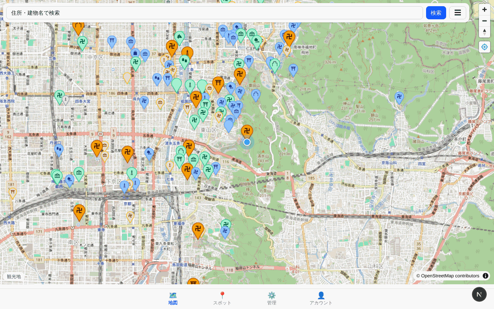
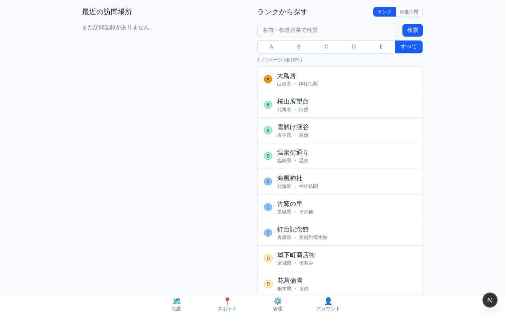
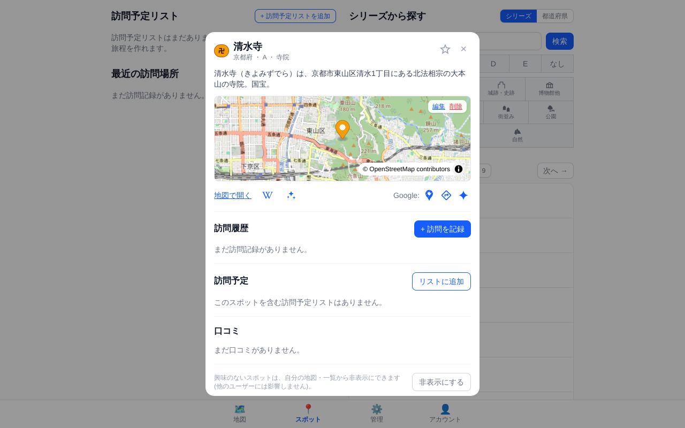
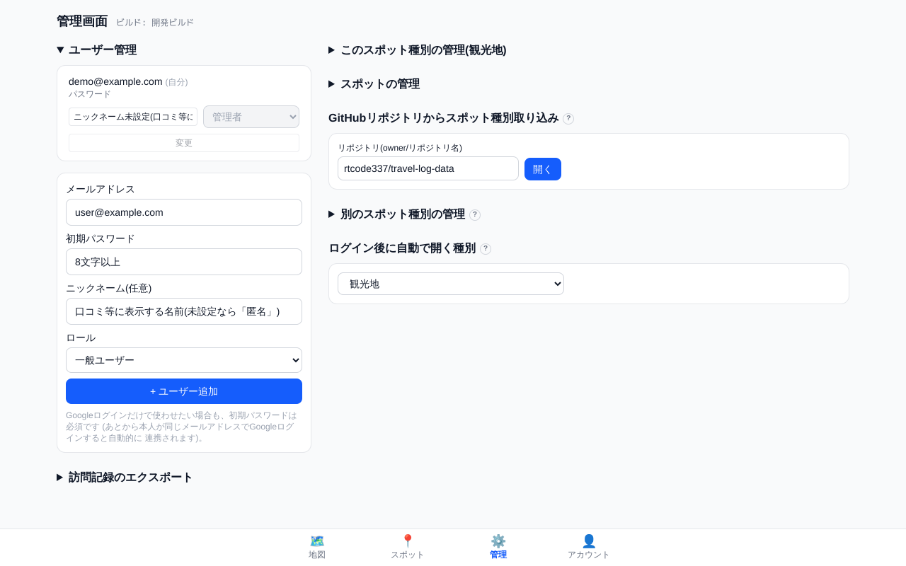
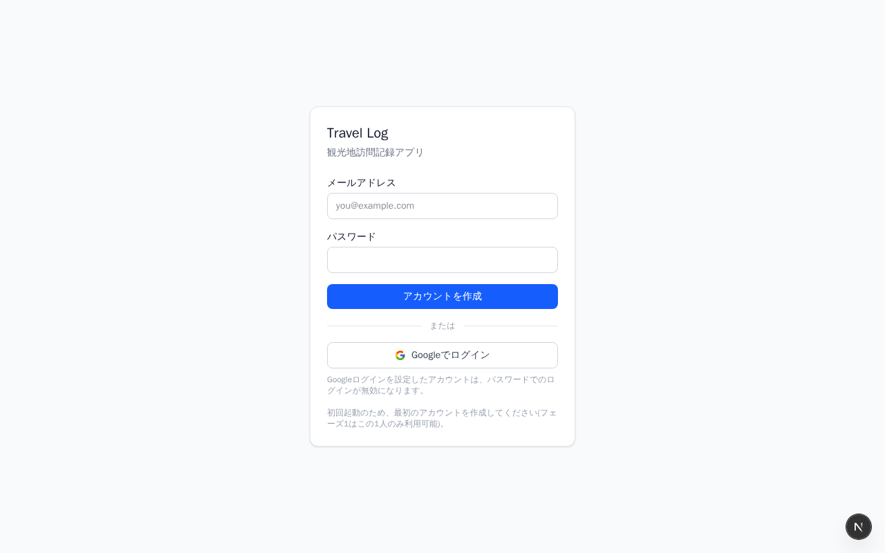

# Travel Log — 観光地訪問記録アプリ

観光地への「訪問記録」を主役にしたアプリ。



## 主な機能

- **地図中心のスポット閲覧**。ランク別のピン(A〜Eの順に大きく・目立つ色)、ランク・訪問状態・カテゴリでの絞り込み
- **必訪ランク(A〜E)** をキュレーション項目として付与(口コミ評価とは別軸)
- **訪問記録**(いつ・何回・メモ・写真)と、同一スポットへの複数回訪問に対応
- **訪問予定**(行きたい場所のブックマーク)。訪問を記録すると自動的に外れる
- **口コミ**(公開・本文のみのシンプルな投稿)
- スポットには「種別」があり(観光地・郵便局・御朱印など)、種別ごとに独立したURL・独自のランク/カテゴリ/対象地域を持てる。管理者が自由に追加・削除できる
- 種別ごとに**対象地域**を選べる(既定は日本=都道府県、特定の国=州・県、世界全体=国ごと)
- **PWA対応**(インストール可能)。スマホの「ホーム画面に追加」やPCブラウザのインストール機能で、アドレスバーなしの独立アプリとして起動できる(オフライン対応は未実装)

## スクリーンショット

| 地図 | スポット一覧 |
|---|---|
|  |  |

| スポット詳細 | 管理画面 |
|---|---|
|  |  |

*スクリーンショットはすべてサンプルデータです。*

## 技術スタック

| 領域 | 採用技術 |
|---|---|
| フロントエンド | Next.js (App Router) + TypeScript |
| UI | Tailwind CSS |
| 地図 | MapLibre GL JS(OpenStreetMap タイル) |
| バックエンド | Next.js Route Handlers + PostgreSQL(Docker上でローカル完結) |

## セットアップ

```bash
docker compose -f docker-compose.dev.yml up --build
```

Node や Postgres をローカルにインストールする必要はない。初回起動時、Postgres コンテナが
`db/init/01_schema.sql` を自動実行してテーブルと既定のスポット種別(`tourist`=観光地、
データは空)を作成する。

http://localhost:3000 を開くと `/login` にリダイレクトされる。初回はアカウントが
存在しないため「アカウントを作成」フォームが表示されるので、メールアドレスと
パスワード(8文字以上)を入力して初回アカウントを作成する(自動的に管理者になる)。
他のユーザーを増やしたい場合は、管理者が`/[type]/admin`の「ユーザー管理」から追加する。



観光地データを含め、スポットデータは同梱していないため、ログイン後に
[外部データ(travel-log-data)](#外部データtravel-log-data)の手順でCSVインポートする。

<details>
<summary>Docker を使わない場合</summary>

ローカルに Postgres を別途用意し、`.env.example` を `.env.local` としてコピーして
`DATABASE_URL` / `SESSION_SECRET` を設定した上で `npm install && npm run dev` でも
起動できる。その場合は `db/init/01_schema.sql` を手動で実行する。

</details>

<details>
<summary>Googleログインの設定(任意)</summary>

メールログインに加えて、Googleアカウントでのログインも利用できる(設定しない場合は
メールログインのみ)。

1. [Google Cloud Console](https://console.cloud.google.com/apis/credentials) で
   OAuthクライアントID(種類: ウェブアプリケーション)を作成する
2. 「承認済みのリダイレクトURI」に `http://localhost:3000/api/auth/google/callback`
   を追加する(本番環境ではそのドメインのURLも追加する)
3. 発行された クライアントID / クライアントシークレット を設定する
   - Docker Compose の場合: リポジトリ直下に `.env` ファイルを作成し、
     `GOOGLE_CLIENT_ID` / `GOOGLE_CLIENT_SECRET` を書く(Next.js が読む
     `.env.local` とは別物なので注意)
   - Docker を使わない場合: `.env.local` に同じ2つの値を追加する

既存のメールアカウントと同じメールアドレスでGoogleログインした場合は自動的に紐付く。
自由なサインアップはできず、管理者が作成したアカウントのみログインできる。

</details>

### 本番運用

`main`へのpushでGitHub Actions(`.github/workflows/docker-publish.yml`)が本番用イメージを
ビルドして`ghcr.io/rtcode337/travel-log:latest`(+コミットSHAタグ)へ公開する。
本番ホストでは本リポジトリのクローン(`docker-compose.yml`と`db/init/`を使う)を置き、
イメージはビルドせずpullして使う。

```bash
# 初回のみ: SESSION_SECRETを設定(リポジトリ直下の.envに書いておくのが楽)
echo "SESSION_SECRET=$(openssl rand -base64 32)" >> .env

# 初回・更新とも共通
docker compose pull app && docker compose up -d
```

- GHCRのパッケージは初回公開時点では非公開のため、GitHubのPackages設定でPublicに
  切り替えるか、本番ホストで`docker login ghcr.io`(`read:packages`権限のPAT)しておく
- イメージは`linux/amd64`のみ。arm64ホストで動かす場合はワークフローの`platforms`に
  `linux/arm64`を追記する
- 特定時点に戻したいときは`docker-compose.yml`のイメージタグを`latest`から
  `sha-xxxxxxx`(Actionsが付けるコミットSHAタグ)に一時的に変えてpullし直す

## 画面

すべて`/[種別キー]/...`の形式(例: `/tourist/map`)で、種別ごとに切り替えて使う。
ルートパス`/`はログイン後、既定の種別の`/map`へ自動リダイレクトされる。

| パス | 内容 |
|---|---|
| `/[type]/map` | 地図(ホーム)。ランク・訪問状態・カテゴリでフィルタ。ピンタップ→スポット詳細モーダルへ |
| `/[type]/spots` | 「都道府県から探す」(地域別ドリルダウン)と「ランクから探す」(検索+絞り込み+ページング)の2タブ |
| `/[type]/admin` | (管理者・スポット管理者専用)スポットの承認待ちキュー・追加・編集・削除・CSVインポート。adminのみスポット種別の管理・ユーザー管理も可能 |
| `/[type]/account` | 自分のロール表示、ログアウト、他のスポット種別への切り替え |
| `/login` | メールログイン、または Google でログイン(任意、要設定) |

## 権限とスポット承認フロー

| ロール | できること |
|---|---|
| 管理者(admin) | 全操作可能。スポット承認・編集・削除、スポット種別の管理、ユーザー管理。初回セットアップで作成した唯一のアカウントが自動的に管理者になる |
| スポット管理者(spot_admin) | スポットの承認・編集・削除・公開作成(adminと同等)。種別設定・ユーザー管理は不可 |
| モデレーター(moderator) | 地図上でのスポット追加(非公開または承認待ち)。承認待ちキューの閲覧のみ |
| 一般ユーザー(user) | 閲覧、自分の訪問記録・訪問予定の管理、非公開スポットの追加のみ |

新しいアカウントは`/[type]/admin`の「ユーザー管理」(admin専用)から作成する(自由サインアップ不可)。

`/[type]/map`上で右クリック(モバイルは長押し)するとスポットを追加できる。送信時のstatusは
ロールにより既定が異なり(`user`は非公開、それ以外は承認待ち)、admin/spot_adminは
`/[type]/admin`の承認待ちキューから個別承認、または「すべて承認」で一括公開できる。

## 訪問予定・口コミ・訪問写真

スポット詳細モーダルから、以下を管理できる。

- **訪問予定(非公開)**: 「行きたい場所」のブックマーク。訪問を記録すると自動的に外れる
- **口コミ(公開)**: 星評価はなく本文のみ。スポット1件につきユーザー1人1件(再投稿で上書き)
- **写真(非公開)**: 自分の訪問記録にのみ添付。ブラウザ側で縮小・圧縮した上で`photos/`
  フォルダ(Dockerではbindマウント)に保存され、`/api/photos/...`経由(本人のみ)で配信する

スポット詳細にはWikipedia検索による概要表示機能もある(種別ごとにON/OFF・参照言語版を設定可)。

## 外部データ(travel-log-data)

スポットの初期データ(シード用CSV)は本リポジトリには同梱せず、別リポジトリ
[travel-log-data](https://github.com/rtcode337/travel-log-data)にスポット種別ごとの
CSVとして置き、`/[type]/admin`のCSVインポート機能で取り込む(`tourist`=観光地も含め全種別共通)。

```csv
name,name_kana,region,lat,lng,rank,category,description
厳島神社,いつくしまじんじゃ,広島県,34.2959,132.3197,A,神社仏閣,海に浮かぶ大鳥居
```

- 必須列: `name`, `region`, `lat`, `lng`。`rank`/`category`は自由入力
- 差分更新(`name`+`region`+`lat`+`lng`の完全一致で重複判定)のため、同じCSVを
  何度アップロードしても重複登録されない

観光地(`tourist`)データの`description`はWikipedia記事冒頭文の引用(CC BY-SA 4.0)、
`name`/`lat`/`lng`の一部はOpenStreetMap由来(ODbL)のため、それぞれの出典表示は
travel-log-data側で行っている(本リポジトリのMITライセンスはアプリのコードにのみ適用)。
ランクの決め方などデータの詳細はtravel-log-data/README.mdを参照。

## スポット種別のカスタマイズ

管理者は`/[type]/admin`から新しい種別を追加でき、種別ごとに次を設定できる。

- 一般公開のON/OFF(既定OFF=admin/spot_admin限定)、口コミ・Wikipediaリンクの有効/無効
- 対象地域(日本/特定の国/世界)、Wikipedia検索の言語版
- ランクの一覧・見た目(色・地図ピンの大きさ・ラベル)、カテゴリの一覧

キー・表示名の手入力フォームのほか、`{ key, label, settings?, ranks?, categories? }`形式の
JSONファイルアップロードでも一括設定できる(travel-log-dataリポジトリの
`<スポットキー>/settings.json`が実例。スキーマの詳細はtravel-log-data/README.md参照)。

## 今後

- ダッシュボード(都道府県塗り分け、制覇率)
- PWAのオフライン対応(Service Worker)、オープンデータ一括インポート

## ライセンス

[MIT License](LICENSE)
