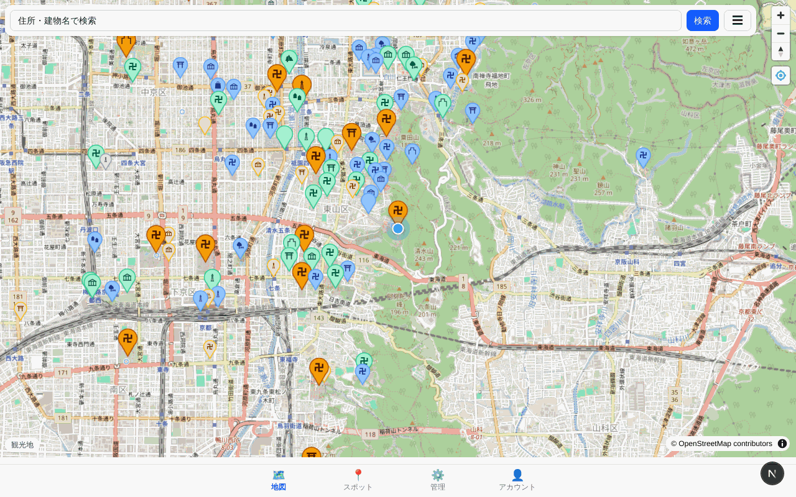
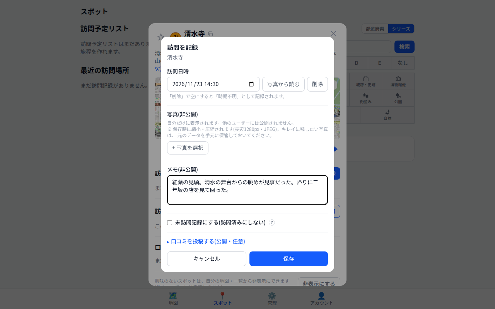
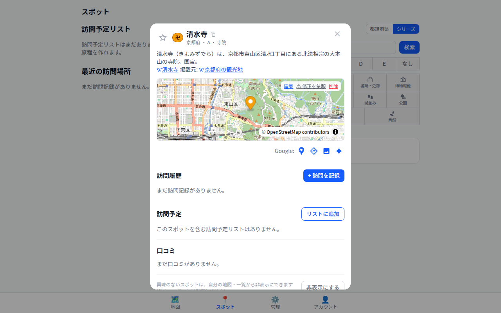

# Travel Log — 観光地訪問記録アプリ

- 観光地への「訪問記録」(いつ・何回・メモ・写真)を地図の上で付けていくアプリ
- 知名度のランクで地図のピンの大きさと色が決まり、行った場所は緑+✓で埋まっていく
- 観光地データは別リポジトリ [travel-log-data](https://github.com/rtcode337/travel-log-data) から管理画面で取り込む

| 地図 | 訪問記録 |
|---|---|
|  |  |

| スポット一覧 | スポット詳細 |
|---|---|
|  |  |

## 主な機能

| 機能 | 説明 |
|---|---|
| **絞り込み** | ランク・シリーズ・訪問状態・カテゴリ・訪問日で絞れる。訪問日は「今日」「過去1年」をカレンダーを開かずに選べる |
| **見た目の3軸** | **ランク**(A〜E。色と大きさ)・**シリーズ**(1スポットに1つ。ピンの中のアイコンと形)・**カテゴリ**(複数可。絞り込み専用) |
| **訪問予定** | 行きたい場所のブックマーク。訪問を記録すると自動的に外れる |
| **訪問予定リスト** | 複数スポットを順序付きでまとめた旅程。地図に紫の矢印で経路を描き、Googleマップの経路検索へそのまま渡せる。回り終わったリストは**アーカイブ**して一覧から下げられる(中身は残り、スポット画面の「アーカイブ」から読み直せる) |
| **訪問記録への追記** | 後から思い出したこと・分かったことを、**訪問回数を増やさずに**同じ訪問記録へ書き足せる。「◯月◯日に追記」として元の記録の下に並び、写真も付けられる |
| **未訪問記録** | 「行ったが見られなかった」「事前の下調べ」を、訪問済みに数えない記録として残せる。日時を入れればその日の経路に含まれ、入れなければ下調べのメモになる |
| **非表示スポット** | 興味のない公開スポットを、自分の地図・一覧からだけ隠せる(他のユーザーには影響しない) |
| **口コミ** | 公開・本文のみのシンプルな投稿(同じスポットに何件でも書ける) |
| **スポット種別** | 観光地・郵便局・御朱印など。種別ごとに独立したURL・シリーズ・カテゴリ・対象地域を持ち、管理者が自由に追加・削除できる |
| **経路(巡った順の矢印)** | 巡った順に繋いだ線と矢印を地図に出す(CSVで取り込む)。線をタップすると経由地の一覧と区間ごとの説明が開く |
| **訪問日の軌跡** | 訪問記録のある日をカレンダーから選ぶと、その日に回った順に矢印で結んだ軌跡が出る。期間指定もできる |
| **旅程の天気** | 訪問予定リストの各スポットに予定日の予報アイコンが出る。**予定日の前後1週間を並べて天気の良い日を探し**、旅程の長さを保ったまま予定日をずらせる |
| **重ね表示** | 別のスポット種別を半透明で同じ地図に重ねられる |
| **対象地域** | 種別ごとに日本(都道府県)・特定の国(州・県)・世界全体(国)から選べる |
| **AIに聞く** | スポットの詳細から、Gemini(Google検索のAIモード)に所在地と座標を添えて質問できる(営業時間とアクセスを先に答えるよう頼んである) |
| **PWA対応** | ホーム画面に追加して、アドレスバーなしの独立アプリとして起動できる(オフライン対応は未実装) |

画面・権限・各機能の詳細は [docs/features.md](docs/features.md)。

## 本番運用

`main`へのpushでGitHub Actionsが本番用イメージを`ghcr.io/rtcode337/travel-log`
(`latest`とコミットSHAのタグ)へ公開する。本番ホストではリポジトリのクローン
(`docker-compose.yml`を使う)を置き、イメージはpullして使う。

```bash
# 初回のみ: SESSION_SECRETを設定(リポジトリ直下の.envに書いておくのが楽)
echo "SESSION_SECRET=$(openssl rand -base64 32)" >> .env

# 初回・更新とも共通
docker compose pull && docker compose up -d
```

- http://localhost:7040 を開き、最初のアカウントを作る(自動的に管理者になる)。
  ほかのユーザーは管理画面の「ユーザー管理」から足す
- **DBスキーマの更新は自動**(起動時に未適用のマイグレーションを当てる)
- **データの置き場は`data/`の1つだけ**。バックアップは停止してから`data/`をコピーする
- スポットデータは同梱していないので、ログイン後に[外部データ](#外部データtravel-log-data)を取り込む

バックアップと復元・リポジトリを置けない環境(YAMLを貼り付けて起動するタイプ)・
Googleログインの設定は [docs/operations.md](docs/operations.md)、
サーバーを持たずに公開する場合は [docs/hosting-vercel-supabase.md](docs/hosting-vercel-supabase.md) を参照。

## 開発

```bash
docker compose -f docker-compose.dev.yml up --build   # http://localhost:7040
```

Node や Postgres をローカルに入れる必要はない。テストは`npm test`、lintは`npm run lint`。スマホの実機で開くときは、`.env`に
`ALLOWED_DEV_ORIGINS=localhost,127.0.0.1,<ホスト名かIP>`を設定してから起動する
(未設定のまま`localhost`以外で開くと画面が真っ白になる)。

## 外部データ(travel-log-data)

スポットデータ(観光地を含む)は本リポジトリに同梱せず、[travel-log-data](https://github.com/rtcode337/travel-log-data)
にスポット種別ごとのCSVとして置いている。管理画面の「GitHubリポジトリからスポット種別取り込み」で
まとめて取り込める。CSVの形式・差分更新の規則・削除のしかたは [docs/data-import.md](docs/data-import.md)。

観光地データの説明文と座標はWikipedia(CC BY-SA 4.0)・Wikidata(CC0)由来で、出典表示は
travel-log-data側で行っている(本リポジトリのMITライセンスはアプリのコードにのみ適用)。

## 技術スタック

| 領域 | 採用技術 |
|---|---|
| フロントエンド | Next.js (App Router) + TypeScript |
| UI | Tailwind CSS |
| 地図 | MapLibre GL JS(OpenStreetMap タイル) |
| 天気予報 | Open-Meteo(CC BY 4.0。旅程の各スポットの予報アイコン) |
| バックエンド | Next.js Route Handlers + PostgreSQL(Docker上でローカル完結) |

## ライセンス

[MIT License](LICENSE)
