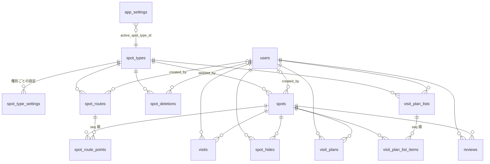
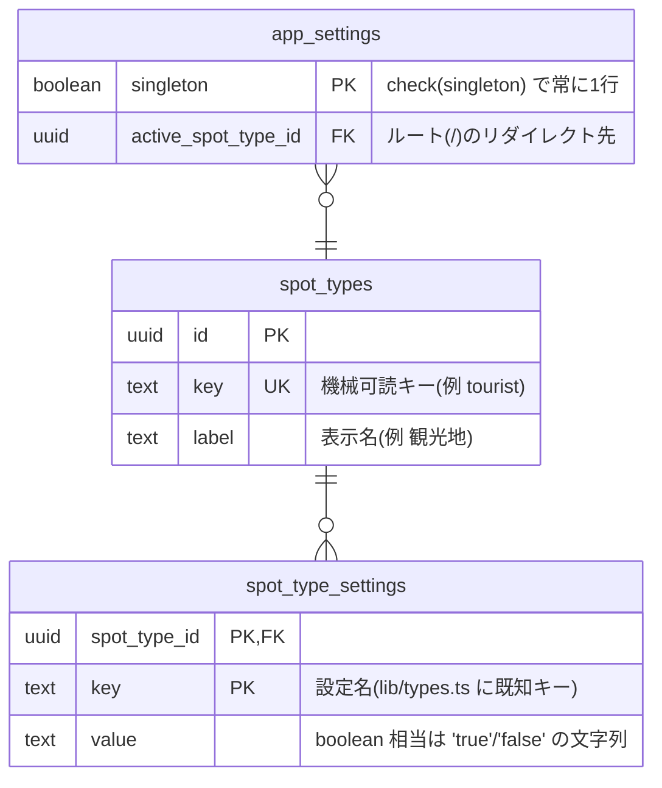
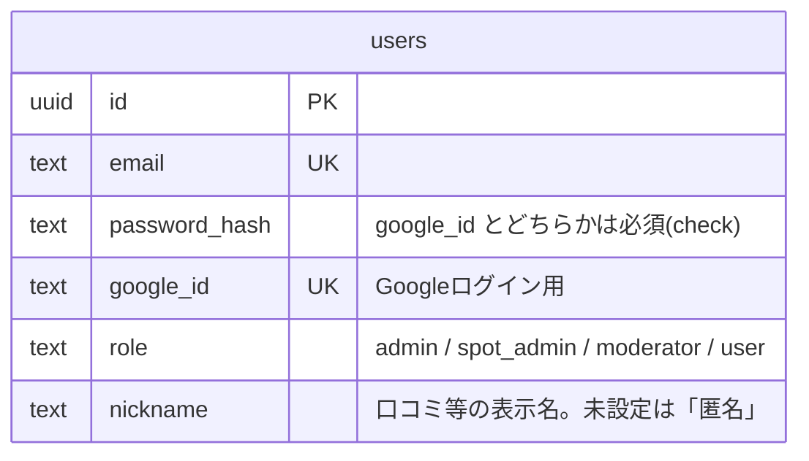
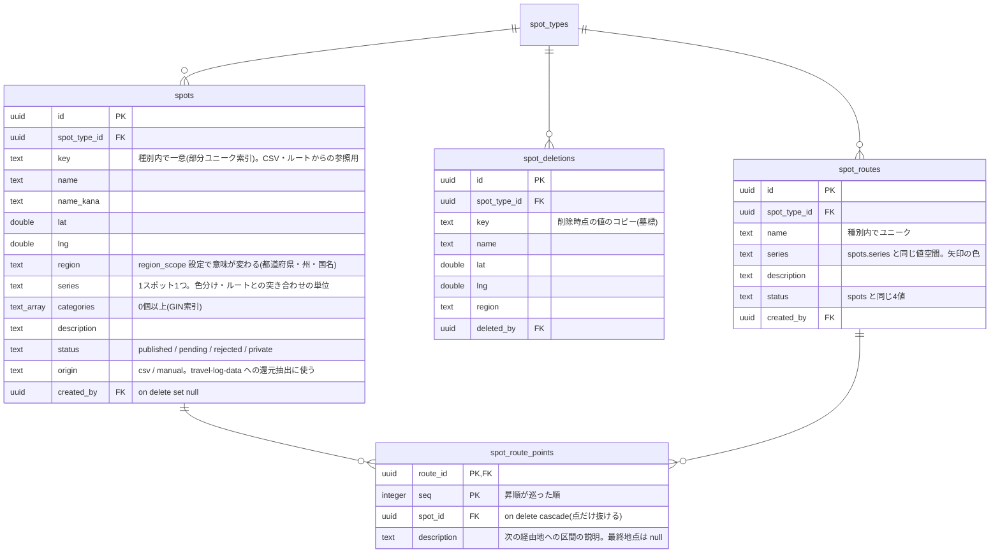
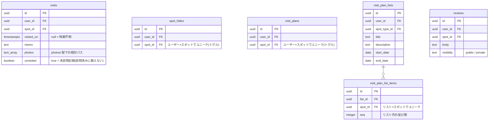

# データベース定義

PostgreSQL のテーブル定義と、テーブル間の関係をまとめた文書。**スキーマ本体と
マイグレーションをたどらなくても全体像が分かるようにするため**に置いている。

定義の**権威は [`db/init/01_schema.sql`](../db/init/01_schema.sql)**(テーブル・索引・
トリガー・初期データのすべて。「現在あるべきスキーマの唯一の定義」)。この文書はそれを
読める形に写したもので、列ごとの細かい経緯は SQL のコメントに書いてある。
[`db/migrations/`](../db/migrations/) は既存 DB を保持したまま移行するためのスクリプトで、
最終形はマイグレーションではなくスキーマ本体の側が持つ。

**DB に変更を入れたら、同じコミットでこの文書も更新する**(手順は末尾)。

## 全体像

中心は `spots`(スポット)で、種別(`spot_types`)がスポットの名前空間になる。
ユーザーごとの記録(訪問・非表示・予定・口コミ)はすべて `users` × `spots` に紐づく。

このほかに、どのテーブルとも関係を持たない `schema_migrations`(適用済み
マイグレーションの記録。[`db/entrypoint.sh`](../db/entrypoint.sh) が作る)がある。

## 横断的な決めごと

- **主キーは `uuid`**(`gen_random_uuid()`、pgcrypto 拡張)。例外は複合キーの
  `spot_type_settings`(種別×キー)と `spot_route_points`(ルート×seq)、
  singleton の `app_settings`
- **全テーブルに `created_at` / `updated_at`** を持ち、`updated_at` は共有の
  `set_updated_at()` トリガーが自動更新する。日時はすべて `timestamptz`
- **列挙は数値ではなく文字列 + `check` 制約**(`users.role`・`spots.status`・
  `spots.origin`・`reviews.visibility`)。`psql` で覗いたときに読めるほうを優先
- **外部キーは実際に張ってある**。削除時の挙動で役割を分けている:
  **記録・従属データは `on delete cascade`**(スポットを消せば訪問記録も消える)、
  **作成者への参照は `on delete set null`**(ユーザーを消しても作ったスポット・
  ルートは残る)
- **公開状態(`status`)は `spots` と `spot_routes` で共通の4値**。
  `published`(全員に見える)/ `pending`(承認待ち。本人 + moderator 以上)/
  `rejected`(却下)/ `private`(作成者本人のみ。誰でも作れる非公開スポット)
- **「ユーザー×スポットで1件まで」のトグル型テーブル**(`spot_hides` /
  `visit_plans`)は `unique (user_id, spot_id)` で構造ごと保証する
- **写真の実体は DB に入れない**。`visits.photos` は `text[]` の相対パス
  (`<ユーザーID>/<年>/<月>/<uuid>.<拡張子>`)で、実体は bind マウントされた
  `photos/` に置く(`lib/photos.ts`)。DB と `photos/` は一緒にバックアップする
- **`visits.visited_on` の null は「時期不明」**(訪問した日を覚えていない)。
  `unvisited = true` は「未訪問記録」で、訪問済みの判定には数えない

## テーブル

### 種別と設定

- **`spot_type_settings` は EAV 形式**。設定を追加するたびに `spot_types` に列を
  増やさずに済む。**行が無いキーは設定ごとの既定値**として扱う(口コミの有効化・
  管理者限定閲覧のような boolean のほか、`series_styles`・`categories`・
  `region_scope` など JSON・文字列値のキーもある)
- 画面・API の対象種別は常に URL の `/[type]/...` で決まる。`app_settings` は
  「ログイン後に自動で開く種別」を決めるためだけの 1 行

### アカウント

- 自由サインアップは無く、管理者が作成する。**最初の1アカウントだけ**セットアップ
  画面から作成でき、自動的に admin になる

### スポットとルート

- **`spots.key` は自然キー(名前)ではなく明示キー**。改名・座標修正で
  ルート CSV からの参照が壊れないようにするため。不要なスポットは null でよい
- **`spot_deletions` は削除の墓標**。CSV 由来の公開スポットを画面から個別削除した
  ときだけ記録し、travel-log-data 側の `exclude.txt` へ追記する候補として
  還元用エクスポートに出す(行が消えるので値をコピーして残す)

### ユーザーごとの記録

- **`visits` は同一スポットへの複数回訪問を許容する**(トグルではない)
- **`visit_plans`(1スポットの予定)と `visit_plan_lists`(順序付きの旅程)は独立**。
  訪問を記録すると `visit_plans` からは自動で消える
- **`reviews` は掲示板方式**(1ユーザーが同じスポットに何件でも書ける)。機能自体の
  ON/OFF は種別ごとに `spot_type_settings` の `reviews_enabled` で切り替える。
  シリーズ表示ロジックには `reviews` を一切参照させない

### 索引

ユニーク制約・主キー由来のものを除いた、検索用の索引。

| テーブル | 索引 | 何のため |
|---|---|---|
| spots | `region` / `series` / `spot_type_id` | 地図・一覧の絞り込み |
| spots | `categories`(GIN) | 複数カテゴリの包含検索(`&&`) |
| spots | `(spot_type_id, key)` ユニーク(key が null 以外) | CSV・ルートからの参照キー |
| spot_deletions | `spot_type_id` | 還元用エクスポートの抽出 |
| spot_routes | `series` | シリーズ絞り込みとの連動 |
| spot_route_points | `spot_id` | スポットからの逆引き |
| visits / spot_hides / visit_plans | `user_id` / `spot_id` | ユーザーの記録の取得と逆引き |
| visit_plan_lists | `user_id` / `spot_type_id` | 旅程の一覧 |
| visit_plan_list_items | `list_id` / `spot_id` | 旅程の中身と逆引き |
| reviews | `spot_id` | スポット詳細の口コミ一覧 |

## 変更手順

1. **[`db/init/01_schema.sql`](../db/init/01_schema.sql) を直す**(唯一の定義。
   追加分を別の初期化ファイルに切り出さない)
2. **同じコミットで [`db/migrations/`](../db/migrations/) に移行スクリプトを足す**
   (`<連番>_<内容>.sql`。全文 idempotent にする。`begin`/`commit` と
   `schema_migrations` への insert は書かない —— `db/entrypoint.sh` が受け持つ。
   詳細は [`db/migrations/README.md`](../db/migrations/README.md))
3. **この文書も同じコミットで更新する**(テーブル・列・索引・制約・関係の変更)
4. 適用は `docker compose up` で自動(`init` サービス)。現物を確かめるなら
   `docker compose exec db psql -U travel_log -d travel_log -c '\d+ spots'`
