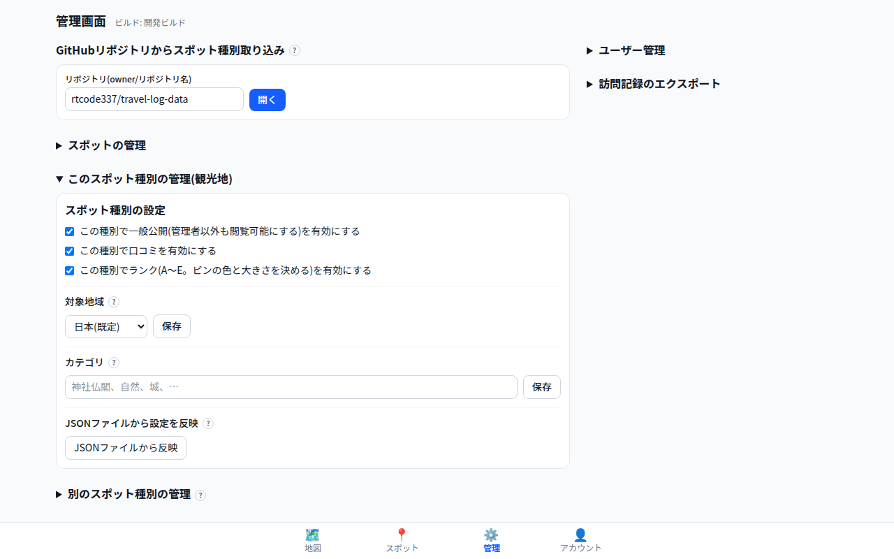
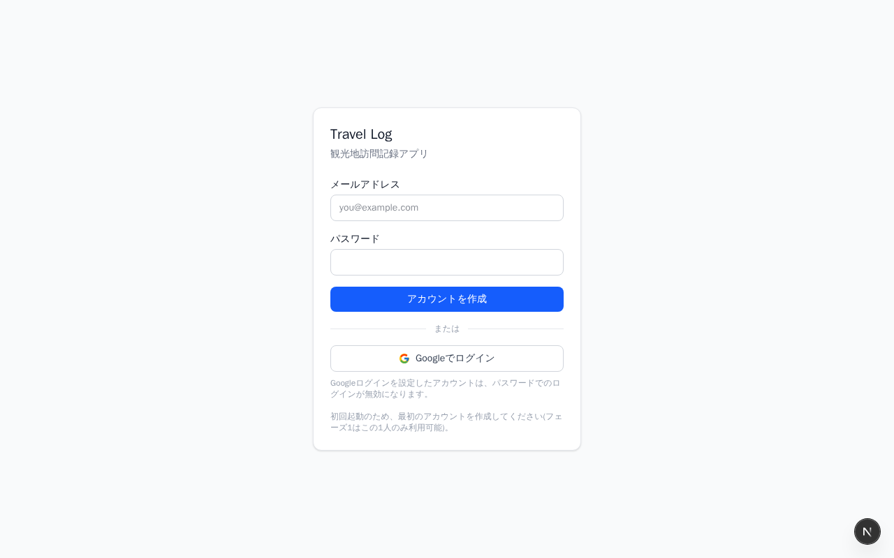

# 機能の詳細

画面・権限と、スポット詳細から管理できるものの詳細。機能の一覧は [README](../README.md) を参照。

## 画面

すべて`/[種別キー]/...`の形式(例: `/tourist/map`)で、種別ごとに切り替えて使う。
ルートパス`/`はログイン後、最後に開いていた種別(無ければ管理画面で設定した既定の種別)の`/map`へ自動リダイレクトされる。

| パス | 内容 |
|---|---|
| `/[type]/map` | 地図(ホーム)。ランク・シリーズ・訪問状態・カテゴリでフィルタ。ピンタップ→スポット詳細モーダルへ。別の種別のダウンロード済み公開スポットを半透明で重ねて表示することもできる(複数の種別を同時に重ねられる。タップで読み取り専用の詳細を表示し、そこから訪問記録と今の種別の訪問予定リストへの追加ができる)。経路・訪問順・訪問予定リストの詳細からはGoogle マップの経路検索で開ける(訪問予定リストの詳細では、地点の左端の≡をつかんで回る順番を入れ替えられる)。左下に今表示中のスポット種別名を小さく表示 |
| `/[type]/spots` | 左に「自分の記録」(訪問予定・訪問予定リスト・最近の訪問場所など)、右に「探す」(都道府県などの地域別ドリルダウン/シリーズの検索+絞り込み+ページング)の2カラム。狭い画面ではタブで切り替える |
| `/[type]/admin` | (管理者・スポット管理者専用)スポットの承認待ちキュー・追加・編集・削除・CSVインポート・経路(巡った順の矢印)のインポート・travel-log-dataへの還元用エクスポート(手動追加した公開スポットと画面から削除したCSV由来スポットの一覧をMarkdownでダウンロード)・修正・追加の依頼の一覧(名前・座標・理由をまとめて渡すテキストにできる/未依頼・対応中ごとにまとめて削除できる)。adminのみキー一覧を指定しての削除・GitHubリポジトリ(travel-log-data形式)からの一括取り込み・スポット種別の管理・ユーザー管理も可能 |
| `/[type]/account` | 自分のメールアドレス・ロール・現在の種別の表示、ログアウト、訪問記録ZIPのダウンロード(管理者が作成したとき)、アカウント削除。スポット種別の切り替えは`/[type]/map`の左下の種別チップから行う |
| `/login` | メールログイン、または Google でログイン(任意、要設定) |

| 管理画面 | ログイン |
|---|---|
|  |  |

## 権限とスポット承認フロー

| ロール | できること |
|---|---|
| 管理者(admin) | 全操作可能。スポット承認・編集・削除、スポット種別の管理、ユーザー管理。初回セットアップで作成した唯一のアカウントが自動的に管理者になる |
| スポット管理者(spot_admin) | スポットの承認・編集・削除・公開作成(adminと同等)。種別設定・ユーザー管理は不可 |
| モデレーター(moderator) | 地図上でのスポット追加(非公開または承認待ち)。承認待ちキューの閲覧のみ |
| 一般ユーザー(user) | 閲覧、自分の訪問記録・訪問予定の管理、非公開スポットの追加のみ |

新しいアカウントは`/[type]/admin`の「ユーザー管理」(admin専用)から作成する
(既定では自由サインアップ不可。`GOOGLE_AUTO_SIGNUP`については[運用ガイド](operations.md#googleログインの設定任意)を参照)。

利用者は自分でアカウント画面から**アカウント削除**できる。訪問記録・写真・訪問予定・口コミ・非公開スポットは
消え、登録した公開スポットは登録者の情報だけを外して残る(他のユーザーの地図から消さないため)。
最後の管理者はアカウントを削除できない。

`/[type]/map`上で右クリック(モバイルは長押し)するとスポットを追加できる
(admin/spot_adminには、スポットを作らずに「ここにスポット追加を依頼」も出る)。送信時のstatusは
ロールにより既定が異なり(`user`は非公開、それ以外は承認待ち)、admin/spot_adminは
`/[type]/admin`の承認待ちキューから個別承認、または「すべて承認」で一括公開できる。
追加フォームの「訪問を記録」(名前欄の下)を開いたまま送信すると、そのスポットに訪問記録が1件つく
(いま訪れている場所を、追加と記録の2手順を踏まずに残せる)。

## 訪問予定・未訪問記録・口コミ・訪問写真

スポット詳細モーダルから、以下を管理できる。

- **訪問予定(非公開)**: 「行きたい場所」のブックマーク。訪問を記録すると自動的に外れる
- **未訪問記録(非公開)**: 訪問記録と同じフォーム・同じ訪問履歴に「訪問済みに数えない
  記録」として残すメモ(訪問記録フォームのチェックボックスから)。
  訪問日を入れると「訪れたが改めて来たい」記録としてその日の訪問順の経路に含まれ、
  訪問予定からも外れる。訪問日なしは下調べのメモになり、訪問予定は残る。
  どちらもピンは緑にならず、一覧では「未訪問」バッジ付きで表示される
- **非表示スポット**: 興味のない公開スポットを自分の地図・一覧から隠すユーザーごとの設定。
  解除は`/[type]/spots`の「非表示にしたスポット」から
- **修正・追加の依頼(管理者・スポット管理者のみ)**: 中身がおかしい公開スポットに
  (スポット詳細の「修正を依頼」)、または地図に無いスポットの場所に(右クリックの
  「ここにスポット追加を依頼」)理由を添えて残す(理由は空でもよい)。スポット自体には
  影響せず、`/[type]/admin`の一覧に集まる。一覧からは名前・座標・理由のテキストに
  まとめて渡せ、渡したものは「対応中」の印で未依頼と見分けられる。片付いたら未依頼・対応中ごとに
  まとめて削除できる。自分が出した依頼は、片付くまで地図に印(追加は「+」、修正はピンを囲む輪)で出る。
  追加の依頼は「+」を押して出る吹き出しから、その場で取り消せる
- **口コミ(公開)**: 星評価はなく本文のみ。投稿するたびに増える掲示板方式で、同じスポットに何件でも書ける
- **写真(非公開)**: 自分の訪問記録にのみ添付。ブラウザ側で縮小・圧縮した上で`data/photos/`
  フォルダ(Dockerではbindマウント)に保存され、`/api/photos/...`経由(本人のみ)で配信する。
  サムネイルをタップすると拡大表示になり、**ピンチ(かダブルタップ)で拡大縮小、
  スワイプで同じ訪問記録の前後の写真へ**移れる(追記に付けた写真も同じ並びに続く)
- **訪問記録のエクスポート**: 管理者が`/[type]/admin`で対象ユーザーのメールアドレスを
  指定して実行すると、そのユーザーの訪問記録を全スポット種別ぶんまとめたZIPが
  バックグラウンドで作られる(`visits-<種別キー>.csv`=訪問のメモ+スポット情報、
  `photos/`=添付写真)。出来上がったZIPは管理画面と、対象ユーザー本人のアカウント画面から
  ダウンロードできる。ZIPは`data/exports/`に置かれ、同じユーザーのものは最新1件だけ残る

説明文に`[ja.wikipedia:記事名]`と書くと、Wikipediaの記事へのリンクになる。

## スポット種別のカスタマイズ

管理者は`/[type]/admin`から新しい種別を追加でき、種別ごとに次を設定できる。

- 一般公開のON/OFF(既定OFF=admin/spot_admin限定)、口コミの有効/無効
- 対象地域(日本/特定の国/世界)
- ランク(A〜E)を使うかどうか
- シリーズの一覧・見た目(ピンの中のアイコン/文字・形・色。色の指定があればランクの色より優先)、カテゴリの一覧

キー・表示名の手入力フォームのほか、`{ key, label, settings?, series?, categories? }`形式の
JSONファイルアップロードでも一括設定できる(travel-log-dataリポジトリの
`<スポットキー>/settings.json`が実例。スキーマの詳細はtravel-log-data/README.md参照)。
